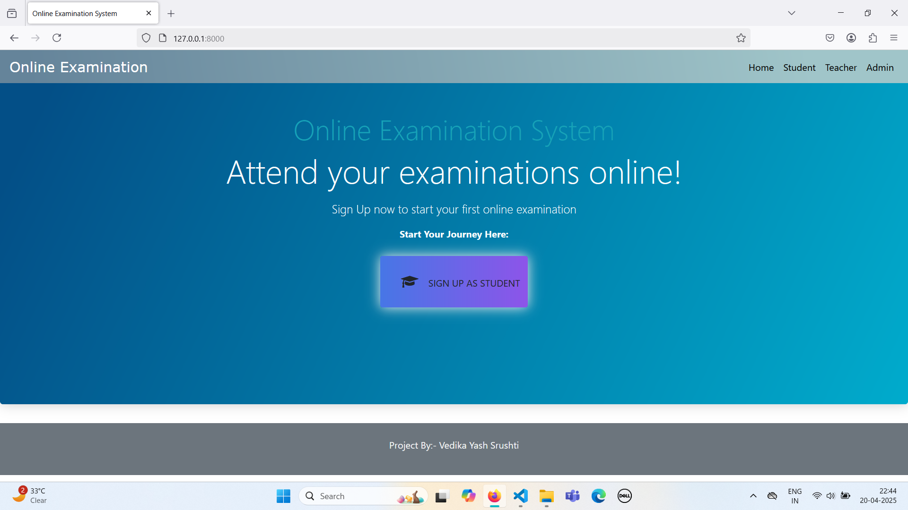
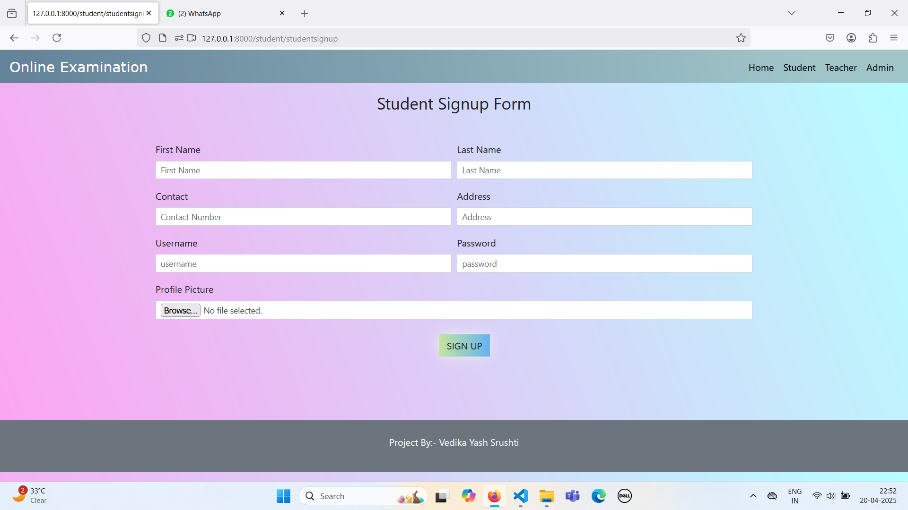
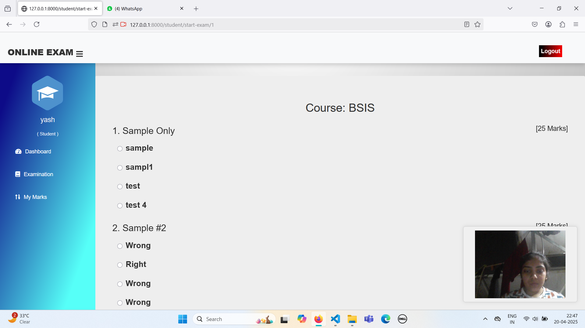
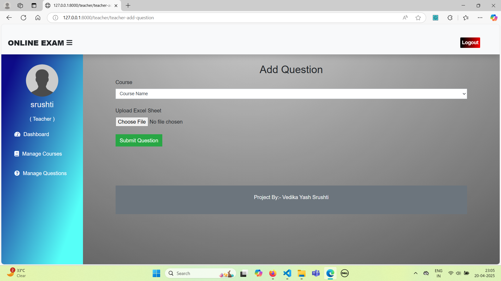
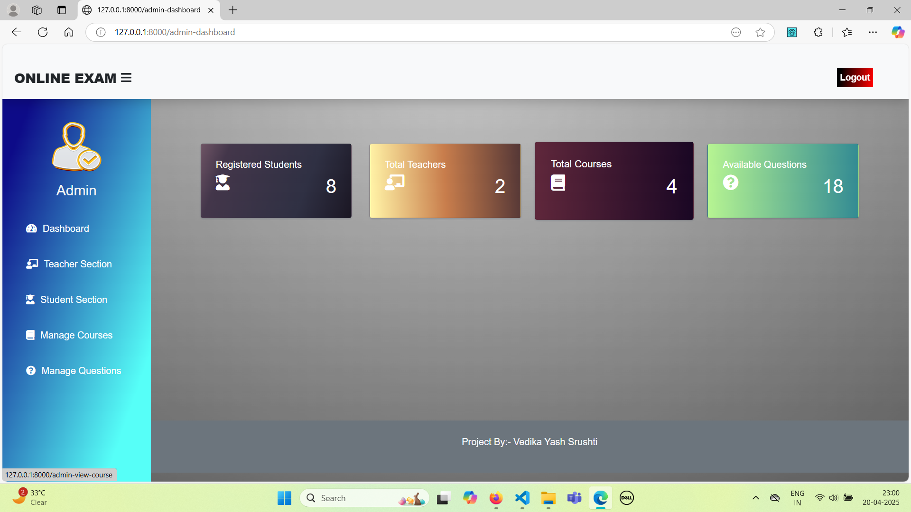
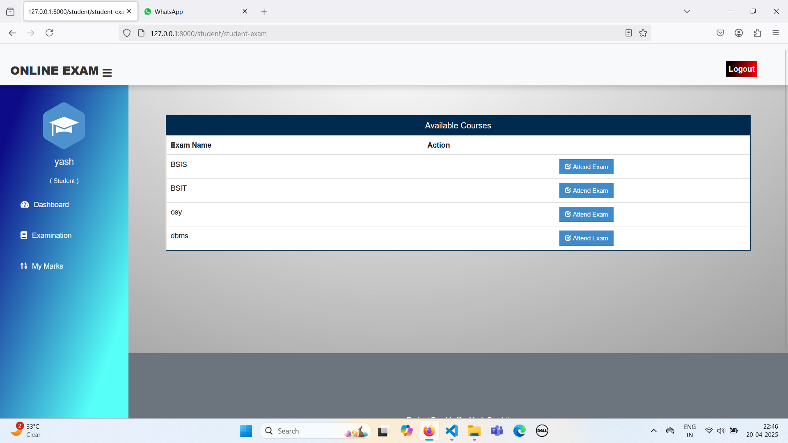

<h1 align="center">🧑‍💻 Online Examination System with Webcam Proctoring</h1>

  
  
  

---

## 📚 Overview

A secure and automated online examination system built with **Python + Django**, integrated with **webcam-based proctoring**, Excel-based question uploads, and **automatic marking**. It ensures fairness and simplicity in conducting exams remotely.

---

## ✨ Features

- 🎥 Webcam-based proctoring for cheating detection
- 📤 Upload questions via Excel files
- 📝 Auto-evaluation with result generation
- 👨‍🎓 Student login and attendance tracking
- 📊 Admin dashboard for exam creation and monitoring
- 📧 Email-based communication and results

---

## 🛠 Tech Stack

| Tech | Purpose |
|------|---------|
| 🐍 Python + Django | Backend server and logic |
| 📸 OpenCV / JS | Webcam proctoring |
| 🧮 Pandas + Excel | Excel-based QnA uploads |
| 🛢 SQLite / PostgreSQL | Database |
| 🔒 Django Auth | Secure student/admin login |
| ✉️ SMTP / Email | Notifications & results |

---

## 🖼️ Screenshots

| 🏠 Home Page | 📝 Signup | 🎥 Exam Panel |
|-------------|-----------|---------------|
|  |  |  |

| ➕ Add Questions | 🧑‍💼 Admin Panel | 📚 Subjects |
|------------------|-----------------|--------------|
|  |  |  |

---

